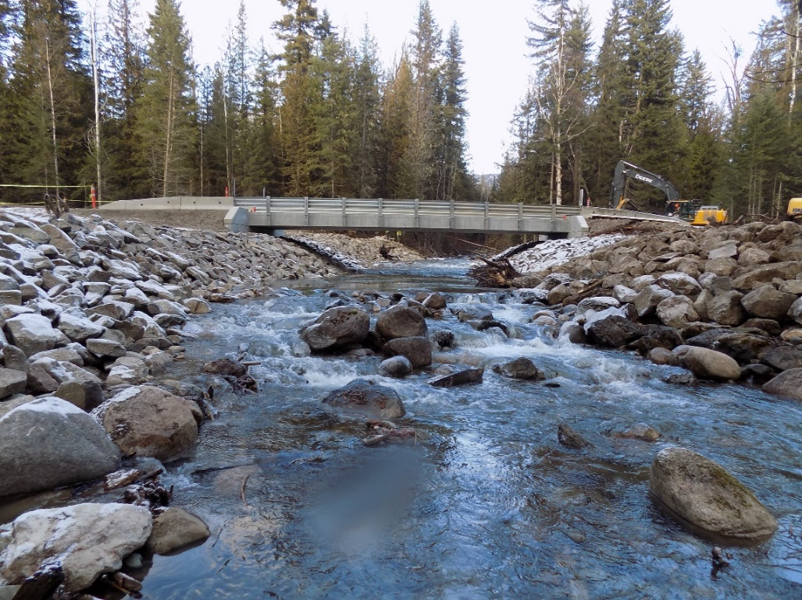
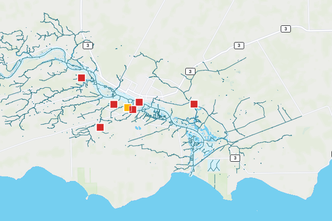
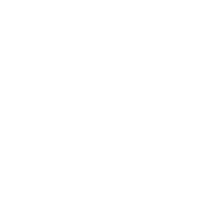

---
title:
author:
date:
output:
  revealjs::revealjs_presentation:
    css: style.css
    incremental: false
    theme: night
    highlight: tango
    transition: none
    center: true
---

# {data-background-color="#0a4f58"}

<h2 style="color: #de3c26;">
Canadian Aquatic Barriers Database
</h2>

<h3>
Supporting fish passage and connectivity conservation in Canada
</h3>

<h5>
Nick Mazany-Wright and Nick Lapointe
</h5>

<h5>
October 29, 2021
</h5>

&nbsp;
&nbsp;
&nbsp;
&nbsp;

<div class="container">
<div class="col">
``` {r, echo=FALSE, out.width="50%", fig.align="left"}

knitr::include_graphics("./img/white-cwf-logo-en.svg")

#AWC3

```
</div>

<div class="col" style="justify-self: end; align-content: end;">
<span style="font-family: Bebas Neue;">Fall 2021 Issues Forum</span>
</div>

</div>

# Project Overview

## National Fish Passage Program

Increased freshwater focus on connectivity and fish passage:

- Watershed Connectivity Remediation Planning framework and barrier remediation in B.C.
- Chinook salmon research in Upper Yukon River
- American eel research and advocacy
- Fish passage advocacy and barrier campaigns
- **<span style="color: #de3c26;">Development of the Canadian Aquatic Barriers Database (CABD)</span>**

&nbsp;

<center>
{height=160px} {height=160px} {height=160px} {height=160px}
</center>

## What is the conservation issue?

What we know:

- Structures like dams, culverts, and dykes block the movement of fish and other species
- Barriers to fish passage are extensive across Canada
- Barriers removal needed to restore access to important habitat
- Restoration projects are expensive

<center>
{height=200px} {height=200px} {height=200px}
</center>

## What is the conservation issue?

What we don't know:

- How many barriers exist in Canada?
- How much habitat is not accessible?
- How do we identify the most important barriers to maximize benefits?

**<span style="color: #de3c26;">We need comprehensive information to answer these questions</span>**

## Canadian Aquatic Barriers Database (CABD)

<center>
**<span style="color: #de3c26;">Vision:</span>**
</center>

<center>
All Canada's barrier and connectivity information in one place -- easily and openly accessible!
</center>

## Project Background

- CABD = central pillar of tools to support CWF's fish passage program
- Identify and prioritize barriers for restoration
- Inspired The Nature Conservancy's (TNC) work in the northeastern U.S.

<center>

</center>

## A Roadmap for Improving Connectivity

- TNC's Northeast Aquatic Connectivity Assessment Project:
  + A database as a partnership building tool
  + Brings groups together and centralizes efforts
  + Led to significant improvements to fish passage and connectivity

## Penobscot River Restoration (Maine)

- Partnership between government, Indigenous groups, NGOs, and industry
- Two dam removals and one fishway
- 2018: **<span style="color: #de3c26;">2.8 million+</span>** river herring returned

<center>
{height=450px}
</center>

## Importance of Collaboration and Engagement

- Potential uses of CABD extend beyond CWF's needs
  + Freshwater connectivity research
  + Hydrological modelling
  + Infrastructure inventories
- CABD can improve collaboration and partnership
- Launched external engagement to get input on design

<center>
{height=250px}
</center>

## Stakeholder Engagement

- User interviews
  + What type of work could the CABD support?
  + What information would be useful?
  + How would users like to access the data?
- Working Group and Technical Advisory Committee

&nbsp;

<center>
{height=50px} {height=50px} {height=50px} {height=50px} {height=50px}
</center>

<center>
{height=25px} {height=50px} {height=25px}
{height=50px} {height=50px}
</center>

<center>
{height=50px} {height=50px} {height=50px}
{height=50px}
{height=50px}
</center>

## Data Gathering and Sharing

- CABD relies on existing repositories
  + Local in scale
  + Single barrier types
  + No standardization
- CWF provides national coordination **<span style="color: #de3c26;">without</span>** duplicating effort
- Establish **<span style="color: #de3c26;">reciprocal</span>** relationships
  + Share data back to providers

&nbsp;

<center>
{height=200px} {height=200px}
</center>

## What will the CABD be used for?

1. Habitat status assessments and reporting (watershed &rarr; national scales)
2. Informing management and regulatory decisions
3. Restoration planning and prioritization
4. Research and monitoring
5. Education and public outreach

## CABD Components

<div class="container">
<div class="col">
1. Streams, rivers,

<center>
and lakes
</center>

<center>
{height=150px}
</center>
</div>

<div class="col">
2. Barrier data

<center>
{height=150px}
</center>
</div>

<div class="col">
3. Web map and tools

<center>
{height=150px}
</center>
</div>

</div>

## Public Launch (version 1)

- Public "sneak peek" release in  pilot regions: **<span style="color: #de3c26;">early November</span>**
- Initial release:
  + Dams, waterfalls, fishways
  + Stream and river networks
- Release remaining data through summer 2022
- Add additional barrier types in future years (e.g., stream crossings)

## Current Contents

&nbsp;

<span style = "font-size: 175%; font-family: Bebas Neue; padding-left: 105px;">Dams</span> <span style = "font-size: 175%; font-family: Bebas Neue; padding-left: 155px;">Waterfalls</span> <span style = "font-size: 175%; font-family: Bebas Neue; padding-left:125px;">Fishways</span>

{height=300px} {height=300px} {height=300} 

<span style = "font-size: 150%; color: #de3c26; padding-left: 65px;">25,000+</span> <span style = "font-size: 150%; color: #de3c26; padding-left: 140px;">10,000+</span> <span style = "font-size: 150%; color: #de3c26; padding-left:170px;">400+</span>

## Demo!

<center>
<a href="https://aquaticbarriers.ca" data-preview-link>Canadian Aquatic Barriers Database</a>
</center>

## Next Steps

- Continue information gathering
  + **<span style="color: #de3c26;">Phase 1:</span>** Compile existing datasets (including stream-crossings)
  + **<span style="color: #de3c26;">Phase 2:</span>** Begin to fill data gaps (with input from citizen scientists!)
- Expand features in the web tool

# Leading Connectivity and Fish Passage Restoration

## Watershed Connectivity Remediation Planning framework

<div class="container">
<div class="col">
- Collaborative framework to plan barrier restoration developed and piloted in B.C.
- Partnership with Alberta Environment and Parks to apply in AB
- Guide document for connectivity planning in Canada
- CABD has and will support watershed-scale planning work
</div>

<div class="col">
<center>

</center>
</div>

</div>

## Fisheries and Oceans Canada

<div class="container">
<div class="col">
- DFO must provide status report on fish and fish habitat in Canada (under new *Fisheries Act*)
  + Connectivity and fish passage is a key component
- **<span style="color: #de3c26;">What is the state of fish habitat connectivity in Canada?</span>**
  + Can't currently answer that question
  + DFO has recognized CABD as critical data source to assess connectivity
- CWF can help centralize, coordinate, and modernize reporting
</div>

<div class="col">
<center>

</center>
</div>

</div>

## Natural Resources Canada

<div class="container">
<div class="col">
- Canada does not have a clean and connected GIS layer representing streams, rivers, and lakes
- CABD requires this layer to relate barriers to habitat gains
- CWF leading development of tools to update the National Hydro Network (NHN)
- Collaboration with NRCan &rarr; our work will be shared to improve the quality of the NHN
</div>

<div class="col">
<center>

</center>
</div>

</div>

## Environment and Climate Change Canada

<div class="container">
<div class="col">
- Connectivity Working Group (Pathway to Canada Target 1)
- Hosted 'Advancing Approaches for Assessing Freshwater Connectivity in Canada' workshop (December 2019)
- CWF contributing to:
  + Implementing Ecological Connectivity in Canada recommendations report
  + Freshwater Connectivity Indicator for Protected Areas in Canada (including CABD data)
</div>

<div class="col">
<center>

</center>
</div>

</div>
  
## Global Dam Watch

<div class="container">
<div class="col">
- International research collaborative developing comprehensive and curated dam and barrier datasets
- Similar mission to the CABD, at global scale
- CWF = member and regional data provider
- Co-authorship of paper accepted to *Environmental Research: Infrastructure and Sustainability*
</div>

<div class="col">
<center>

</center>
</div>

</div>

## Additional Tools

- Barrier assessment protocols
  + Series of regional workshops in winter/spring 2022
  
<center>

</center>

## Additional Tools

**<span style="color: #de3c26;">Develop or adapt citizen science apps</span>**

- Partner and public participation to identify and assess barriers:
  1. Information entry portal - allow direct additions to CABD
  2. Mobile app - public can identify and assess barriers
- Collaboration opportunities with existing apps
  + <a href="https://portal.amber.international/" data-preview-link>AMBER (Europe)</a>
  + <a href="https://image.winudf.com/v2/image1/Y29tLndvb2RsYW5kc25vcnRoLmFid2NpX3NjcmVlbl8yXzE1ODkwNzYyODFfMDYy/screen-2.jpg?fakeurl=1&type=.jpg" data-preview-link>Alberta Watercourse Crossing Inventory app</a>

## Long-term Funding, Hosting, and Management

- Current funding from DFO and RBC Foundation through 2022-23
- Development and data compilation are most expensive phases
- Long-term maintenance and updating = major challenge for databases
  + But, lower annual costs
- Future funding options:
  + Perpetual fundraising?
  + CWF endowment?
  + Hand off to government?

# Thank you!

<center>
<h2>Questions?</h2>
</center>
<center>
nickw@cwf-fcf.org
</center>
<center>
nlapointe@cwf-fcf.org
</center>

